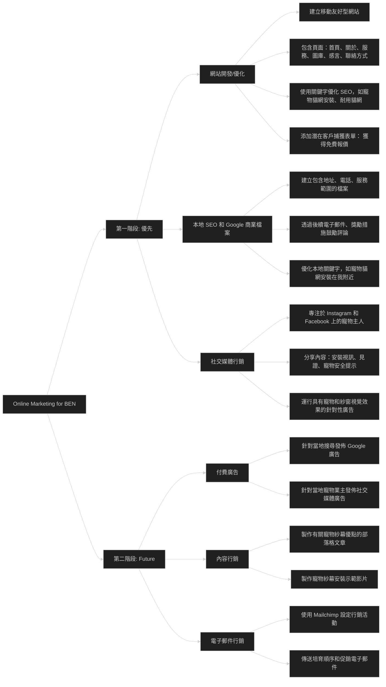
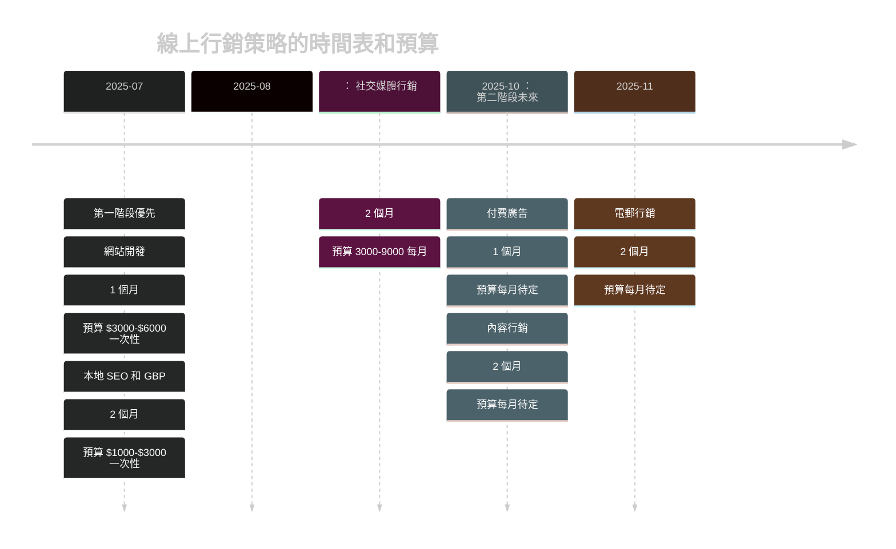

```mermaid
%%{init: {'theme': 'dark'} }%%

flowchart LR
    A["Online Marketing for BEN"] --> B["第一階段: 優先"] & C["第二階段: Future"]
    B --> D["網站開發/優化"] & E["本地 SEO 和 Google 商業檔案"] & F["社交媒體行銷"]
    D --> D1["建立移動友好型網站"] & D2["包含頁面：首頁、關於、服務、圖庫、感言、聯絡方式"] & D3["使用關鍵字優化 SEO，如寵物貓網安裝、耐用貓網"] & D4["添加潛在客戶捕獲表單： 獲得免費報價"]
    E --> E1["建立包含地址、電話、服務範圍的檔案"] & E2["透過後續電子郵件、獎勵措施鼓勵評論"] & E3["優化本地關鍵字，如寵物貓網安裝在我附近"]
    F --> F1["專注於 Instagram 和 Facebook 上的寵物主人"] & F2["分享內容：安裝視訊、見證、寵物安全提示"] & F3["運行具有寵物和紗窗視覺效果的針對性廣告"]
    C --> G["付費廣告"] & H["內容行銷"] & I["電子郵件行銷"]
    G --> G1["針對當地搜尋發佈 Google 廣告"] & G2["針對當地寵物業主發佈社交媒體廣告"]
    H --> H1["製作有關寵物紗幕優點的部落格文章"] & H2["製作寵物紗幕安裝示範影片"]
    I --> I1["使用 Mailchimp 設定行銷活動"] & I2["傳送培育順序和促銷電子郵件"]
    
```

------

```mermaid
%%{init: {'theme': 'dark'} }%%

timeline
    title 線上行銷策略的時間表和預算
	 2025-07 : 第一階段優先
	: 網站開發 : 1 個月 : 預算 $3000-$6000 一次性
	: 本地 SEO 和 GBP : 2 個月 : 預算 $1000-$3000 一次性
	 2025-08
	 ： 社交媒體行銷 : 2 個月 : 預算 3000-9000 每月
	 2025-10 ： 第二階段未來
	: 付費廣告 : 1 個月 : 預算每月待定
	: 內容行銷 : 2 個月 : 預算每月待定
	 2025-11
	: 電郵行銷 : 2 個月 : 預算每月待定
     
```
